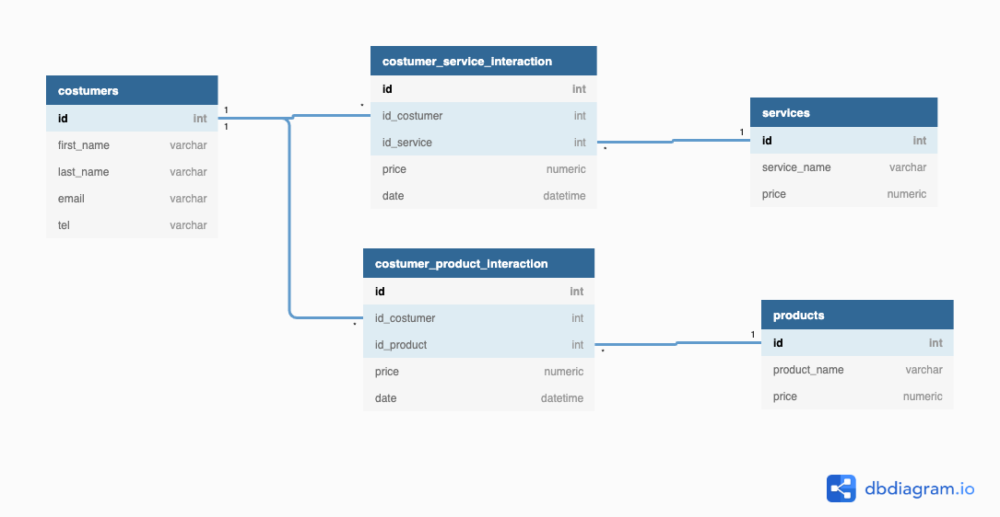

# shiny-app
The goal of the project is to develop a dashboard for the management of hair salon, starting from the following SQL schema:

### Data Aquisition

Customers, Services and Prodcuts contains real data, for privacy reason name and costumers interactions with services and prodcuts are randomly generated using a multicore function to speed up the computation.

1-core computation time:

   user  system elapsed 
106.596   1.928 109.372 

m-core computation time:

   user  system elapsed 
181.340  12.838  37.905 

### Dashboard Layout

the dashboard is compose of three main pages: 

* Overview 
* Services
* Products
* Costumers

#### Overview

The overview page show different type of statistics based on the selected day and frequency.

There are 4 different frequency value:

* Daily: show the statistics of the selected day
* Weekly: aggregate the data over the week of the selected day
* Monthly: aggregate the data over the month of the selected day
* Yearly: aggregate the data over the year of the selected day

The bottom part of the page show the most used service/product and the most profitable service/product, this help the menager to take policy decision.

#### Services

The service page show all the possible services that can be done in the salon and make a comparison of income/frequency of the current year with respect to the past year based on the selected service.

The user can filter the possible service to plot by a text input.

#### Products

The product page use the same concepts of the services page but using prodcuts.

#### Costumers

The costumer page show all the costumer of the salon, by clicking over a customer it open a detailed page of the selected costumer.

It show all the services done and all the product bought by the costumer, ordered by date.

The first  bottom graph show the total month expanditure for the current year and the last year, this help the menager to take targeting advertising decision.

